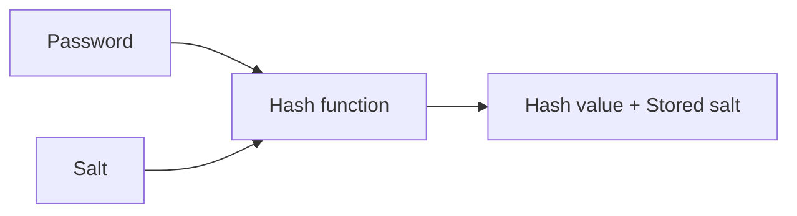

## Hashing Basics

**Hashing** is the process of taking an input of arbitrary size and passing it through a one-way function called a **hash function** to return a **hash value/digest** of fixed length.

Passwords are hashed with **yescrypt hash** (prefix: `$y$`) and stored in `/etc/shadow` which is only readable as root on Linux machines. These are what's used to validate passwords.

```bash
sudo cat /etc/shadow
[sudo] password for rbx86:
rbx86:$y$j9T$REDACTED$REDACTED:19784:0:99999:7:::
```

When a password is entered, it's hashed by libcrypt and validated against the corresponding entry in `/etc/shadow`. Each entry consists of 9 fields (run `man 5 shadow`), and the stored password follows the format `$prefix(hashing algorithm used)$options$salt$hash`. Here are some common prefixes in unix:

|prefix|function name|machine|
|----|----|----|
|`$y$`|yescrypt|linux|
|`$g$`|gost-yescrypt. uses GOST R 34.11-2012 has function + yescrypt|linux|
|`$7$`|scrypt||
|`$2b$`,`$2y$`, `$2a$`, `$2x$`|bcrypt. based on blowfish cipher|BSDs|
|`$6$`|sha512crypt, sha-2 with 512 output||
|`$md5$`|MD5|Solaris|
|`$1`|m5crypt|FreeBSD|

## Salting

Simple hashes are vulnerable to [rainbow table attacks](https://en.wikipedia.org/wiki/Rainbow_table), which we can prevent by **Salting**. It's done by added a unique random string called a **salt** to the password before hashing it. `bcrypt`, `scrypt` and `argon2` does this by default.



Salting also prevents 2 passwords from producing a same hash, a phenomenon called **hash collision**.

## Hash Collision and the Pigeonhole Effect

A **hash collision** is when two distinct pieces of data in a hash table share the same hash value, which is derived from a hash function. Modern cryptographic hash algorithms are made to be collision resistant, but might sometimes map different data to the same hash. This ties into what's known as the **pigeonhole principle**.


For a hash function to be cryptographically secure, it must be resistant to the 3 following attacks:

1. **Pre-image attacks**: For an output $x = hash(m)$, it must be practically impossible to find a message $m_{0}$ such that $hash(m_{0}) = x$.

2. **Second pre-image resistace**: Given a message $m_{1}$, it must be practically imposible to find a message $m_{2}$ such that $hash(m_{1}) = hash(m_{2})$.

3. **Collision resistant**: It should be practically impossible to find 2 messages $m_{1}$ and $m_{2}$, such that $hash(m_{1}) = hash(m_{2})$.

Let's consider a cryptographic hash function `hash()` that takes an input of any size `n` and produces a fixed-size output, for example, a 4-bit output which gives us $2^4 = 16$ possible hash values/digests. A hash collision occurs when any 2 (or more hashes), `M1` and `M2` produces the same hash values. 

$$ hash(M1) = hash(M2), where M1 \neq M2 $$

This violates 1 of the 3 properties that makes a has function cryptographically secure; the **property of second preimage resistance**, which states that given a message `M1`, it must be practically impossible to find a message `M2` such that `hash(M1) = hash(M2)`. 

In the case of our hash function `hash()`, it accepts an input of any length and produces a 4-bit hash value, which means at some point, 2 numbers would have produced the same hash values, making the function vulnerable to **birthday attacks**. `MD5` and `SHA1` are such examples. 

This entire process ties into what's known as the **pigeonhole effect** which states that if you have `n` pigeonholes and `n+1` pigeons, at least **one** pigeonhole must contain more that one pigeon.

## Password cracking

Enough about hashing. How do we crack passwords that have been hashed? A good way to do this is to use `hashcat`. The syntax is: `hashcat -m <hash_type> -a <attack_mode> hashfile wordlist`. For example, 

```bash
hashcat -m 3200 -a 0 hash.txt /usr/share/wordlists/rockyou.txt 
```

which uses the hash code `3200` to manually identify the hash as `bcrypt` and try to brute-force it using the `rockyou` wordlist (you can find it at `/usr/share/wordlists/rockyou.txt.gz`).

Check out my post on [THM's Crack the hash & Crack the hash 2 rooms](https://arjitpraveen.github.io/archive/thm_rooms/crackthehash), if you wanna learn more about cracking hashes. 

---

Crack the hash `9eb7ee7f551d2f0ac684981bd1f1e2fa4a37590199636753efe614d4db30e8e1`. We don't know what hash function was used, so we'll use `haiti` for that.

```bash
haiti 9eb7ee7f551d2f0ac684981bd1f1e2fa4a37590199636753efe614d4db30e8e1
```

Here's what it gave us


Looking up the hash-mode for SHA-256 at [https://hashcat.net/wiki/doku.php?id=example_hashes](https://hashcat.net/wiki/doku.php?id=example_hashes) we see it's `1400`. Now we use hashcat to break it.

```
echo "9eb7ee7f551d2f0ac684981bd1f1e2fa4a37590199636753efe614d4db30e8e1" > hash.txt
hashcat -m 1400 -a 0 hash.txt /usr/share/wordlists/rockyou.txt
```

And this is what it gave us:


Hashcat can also autodetect hashmodes if we haven't specified it

```
echo "$6$GQXVvW4EuM$ehD6jWiMsfNorxy5SINsgdlxmAEl3.yif0/c3NqzGLa0P.S7KRDYjycw5bnYkF5ZtB8wQy8KnskuWQS3Yr1wQ0" > hash2.txt
hashcat -a 0 hash2.txt rockyou.txt
```


It's SHA-512! Let's use `hashcat` to crack it:


Et voilà! The password is `spaceman`.

---

# Sources

- Tryhackme's Hashing Basics: [https://tryhackme.com/room/hashingbasics](https://tryhackme.com/room/hashingbasics)
- pwn.college's Linux Luminarium: [https://pwn.college/linux-luminarium/users/](https://pwn.college/linux-luminarium/users/)
- Cryptohack Hash Functions: [https://cryptohack.org/challenges/hashes/](https://cryptohack.org/challenges/hashes/)
- Hashcat documentation: [https://hashcat.net/wiki/doku.php?i](https://hashcat.net/wiki/doku.php?i)
- Haiti documentation for installation: [https://noraj.github.io/haiti/#/pages/quick-start?id=quick-start](https://noraj.github.io/haiti/#/pages/quick-start?id=quick-start)

<center>

<iframe width="560" height="315" src="https://www.youtube.com/embed/jsraR-el8_o?si=XmCBcNKxOOiAO0CQ" title="YouTube video player" frameborder="0" allow="accelerometer; autoplay; clipboard-write; encrypted-media; gyroscope; picture-in-picture; web-share" referrerpolicy="strict-origin-when-cross-origin" allowfullscreen></iframe>

</center>
