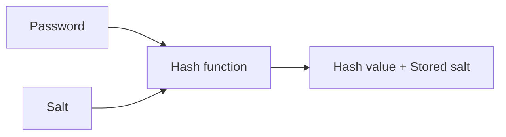

## Hashing Basics

**Hashing** is the process of taking an input of arbitrary size and passing it through a one-way function called a **hash function** to return a **hash value/digest** of fixed length.

Passwords are hashed with **yescrypt hash** (prefix: `$y$`) and stored in `/etc/shadow` which is only readable as root on Linux machines. These are what's used to validate passwords.

```bash
sudo cat /etc/shadow
[sudo] password for rbx86:
rbx86:$y$j9T$REDACTED$REDACTED:19784:0:99999:7:::
```

When a password is entered, it's hashed by libcrypt and validated against the corresponding entry in `/etc/shadow`. Each entry consists of 9 fields (run `man 5 shadow`), and the stored password follows the format `$prefix(hashing algorithm used)$options$salt$hash`. Here are some common prefixes in unix:

|prefix|function name|machine|
|----|----|----|
|`$y$`|yescrypt|linux|
|`$g$`|gost-yescrypt. uses GOST R 34.11-2012 has function + yescrypt|linux|
|`$7$`|scrypt||
|`$2b$`,`$2y$`, `$2a$`, `$2x$`|bcrypt. based on blowfish cipher|BSDs|
|`$6$`|sha512crypt, sha-2 with 512 output||
|`$md5$`|MD5|Solaris|
|`$1`|m5crypt|FreeBSD|

## Salting

Simple hashes are vulnerable to [rainbow table attacks](https://en.wikipedia.org/wiki/Rainbow_table), which we can prevent by **Salting**. It's done by added a unique random string called a **salt** to the password before hashing it. `bcrypt`, `scrypt` and `argon2` does this by default.



Salting also prevents 2 passwords from producing a same hash, a phenomenon called **hash collision**.

## Hash Collision

A **hash collision** is when two distinct pieces of data in a hash table share the same hash value, which is derived from a hash function. Modern cryptographic hash algorithms are made to be collision resistant, but might sometimes map different data to the same hash. This ties into what's known as the **pigeonhole principle**.

<!--  -->

For a hash function to be cryptographically secure, it must be resistant to the 3 following attacks:

1. **Pre-image attacks**: For an output $x = hash(m)$, it must be practically impossible to find a message $m_{0}$ such that $hash(m_{0}) = x$.

2. **Second pre-image resistace**: Given a message $m_{1}$, it must be practically imposible to find a message $m_{2}$ such that $hash(m_{1}) = hash(m_{2})$.

3. **Collision resistant**: It should be practically impossible to find 2 messages $m_{1}$ and $m_{2}$, such that $hash(m_{1}) = hash(m_{2})$.

In a pre-image attack, $x$ is assumed to be known. The second pre-image attack assumes $m_{1}$ is known. The property of collision resistance states that there should be no 2 different messages that produces the same hash output.

### The Pigeonhole Principle

The pigeonhole principle states that if $n$ pigeons are put into $m$ pigeonholes, given $n > m$, there is at least one pigeonhole containing $\Big\lceil m/n\Big\rceil$ pigeons.

Let there be a hash function $h : D \rightarrow R$ that maps an input from a domain $D$ to a finite range $R$ (eg. $\vert R \vert = 2^{256}$ possible outputs for a 256 bit hash like SHA-256). If $\vert D \vert > \vert R \vert$, then at least one output in $R$ must be the image of at least two distinct inputs in $D$. IOW, there exists $x, y \subset D$ such that $h(x) = h(y)$.

### Birthday Attack

---

## Password cracking

We can crack password with hashcat. The syntax is: `hashcat -m <hash_type> -a <attack_mode> hashfile wordlist`. For example, 

```bash
hashcat -m 3200 -a 0 hash.txt /usr/share/wordlists/rockyou.txt 
```

which uses the hash code `3200` to manually identify the hash as `bcrypt` and try to brute-force it using the `rockyou` wordlist (you can find it at `/usr/share/wordlists/rockyou.txt.gz`).

Check out my post on [THM's Crack the hash & Crack the hash 2 rooms](https://arjitpraveen.github.io/archive/thm_rooms/crackthehash), if you wanna learn more about cracking hashes. 

### Using Haiti to detect hash type

Crack the hash `9eb7ee7f551d2f0ac684981bd1f1e2fa4a37590199636753efe614d4db30e8e1`. 

We don't know what hash function was used, so we'll use `haiti` for that.

```bash
haiti 9eb7ee7f551d2f0ac684981bd1f1e2fa4a37590199636753efe614d4db30e8e1
```

This gives us the hash function **SHA-256**. Looking up the hash-mode for SHA-256 at [https://hashcat.net/wiki/doku.php?id=example_hashes](https://hashcat.net/wiki/doku.php?id=example_hashes) we see it's `1400`. Now we use hashcat to break it.

```bash
echo "9eb7ee7f551d2f0ac684981bd1f1e2fa4a37590199636753efe614d4db30e8e1" > hash.txt
hashcat -m 1400 -a 0 hash.txt /usr/share/wordlists/rockyou.txt
```

And this is what it gave us:


---

### Auto-detect hash mode

Crack the hash `$6$GQXVvW4EuM$ehD6jWiMsfNorxy5SINsgdlxmAEl3.yif0/c3NqzGLa0P.S7KRDYjycw5bnYkF5ZtB8wQy8KnskuWQS3Yr1wQ0`

Hashcat can also autodetect hashmodes if we haven't specified it

```bash
echo "$6$GQXVvW4EuM$ehD6jWiMsfNorxy5SINsgdlxmAEl3.yif0/c3NqzGLa0P.S7KRDYjycw5bnYkF5ZtB8wQy8KnskuWQS3Yr1wQ0" > hash2.txt
hashcat -a 0 hash2.txt rockyou.txt
```


It's SHA-512! Let's use `hashcat` to crack it:


Et voilà! The password is `spaceman`.

---

# Sources

- Tryhackme's Hashing Basics: [https://tryhackme.com/room/hashingbasics](https://tryhackme.com/room/hashingbasics)
- pwn.college's Linux Luminarium: [https://pwn.college/linux-luminarium/users/](https://pwn.college/linux-luminarium/users/)
- Cryptohack Hash Functions: [https://cryptohack.org/challenges/hashes/](https://cryptohack.org/challenges/hashes/)
- Hashcat documentation: [https://hashcat.net/wiki/doku.php?i](https://hashcat.net/wiki/doku.php?i)
- Haiti documentation for installation: [https://noraj.github.io/haiti/#/pages/quick-start?id=quick-start](https://noraj.github.io/haiti/#/pages/quick-start?id=quick-start)

