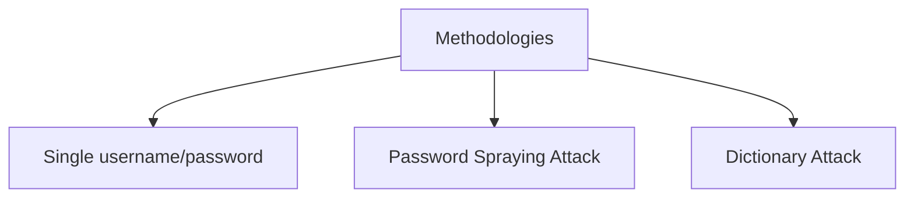

**Hydra** is a powerful online brute-force password cracking tool. It rapidly tests username/password combinations against live services using dictionary or brute-force attacks. Moreover, it supports multi-threading for increased performance and over 50 protocols, including:

```
 Asterisk, AFP, Cisco AAA, Cisco auth, Cisco enable, CVS, Firebird, FTP,
 HTTP-FORM-GET, HTTP-FORM-POST, HTTP-GET, HTTP-HEAD, HTTP-POST, HTTP-PROXY,
 HTTPS-FORM-GET, HTTPS-FORM-POST, HTTPS-GET, HTTPS-HEAD, HTTPS-POST,
 HTTP-Proxy, ICQ, IMAP, IRC, LDAP, MEMCACHED, MONGODB, MS-SQL, MYSQL, NCP, NNTP, Oracle Listener,
 Oracle SID, Oracle, PC-Anywhere, PCNFS, POP3, POSTGRES, Radmin, RDP, Rexec, Rlogin,
 Rsh, RTSP, SAP/R3, SIP, SMB, SMTP, SMTP Enum, SNMP v1+v2+v3, SOCKS5,
 SSH (v1 and v2), SSHKEY, Subversion, Teamspeak (TS2), Telnet, VMware-Auth,
 VNC and XMPP.
```
Since I'm only going to be covering the basics of hydra, with an example for a few protocols, I'd highly recommend checking its [official page](https://github.com/vanhauser-thc/thc-hydra).

### Methodologies

There are several methodologies, we'll cover a few of them. 



#### Single Username/Password

This is **straighforward attack**. All we need is a username and the password we want to test on the system. Say we have a user `molly` with the password `butterfly` on a server located at `10.10.137.76`, and want to test the credentials of `ssh`. Here's how we'll type the command:

```bash
hydra -l molly -p  butterfly 10.10.137.76 ssh

# Alternatively

hydra -l molly -p butterfly ssh://10.10.137.76
```
:::tip
You must to use `[` `]` brackets if you want to supply IPv6 addresses or CIDR notations to attack.
:::

In some cases we might want to specify the port. We will use the following syntax

```bash
hydra -l <USERNAME> -p <PASSWORD> <PROTOCOL>://<TARGET_IP>:<PORT>
```

For example `hydra -l molly -p butterfly ssh://10.10.137.76:2222`.

#### Password Spraying Attack

This is for finding what user is using a specific password. We do this by trying a single password against a list of users. If anyone's using the password, Hydra will find a match. Here's an example, given a password `astrogarfunkel` and a list of usernames.

```bash
hydra -L usernames.txt -p  astrogarfunkel ssh://192.168.1.4 
```
```plaintext
bobsmith01
alicia._.keyes
ar1z0najon3s
```

#### Dictionary Attack

We can perform a dictionary attack by provididing a list of usernames and a **password wordlist** using the `-P` option.

```bash
hydra -L usernames.txt -P passwords.txt ssh://192.168.1.4  
```

My favourite wordlist for passwords is the rockyou wordlist! You can find it in `/usr/share/wordlists/rockyou.xt.gz` on Kali Linux. 


You can otherwise download it from the official repo using `wget`

```bash
wget https://github.com/josuamarcelc/common-password-list/raw/refs/heads/main/rockyou.txt/rockyou.txt.zip
```

### Caveats

Running large brute-force attacks might take considerable time, this is when it's useful to increase the number of threads. We can specify this with the `-T` flag, followed by the number of threads.

```bash
hydra -L users.txt -P /usr/share/wordlists/rockyou.txt -t 4 ssh://192.168.1.4
```
#### Verbosity & Debugging

We can enable verbosity to see every login attempt Hydra makes with a combination to find a match using the `-v` flag. To retrieve even more info, we can use debugging with the `-d` flag. 

#### Output & other flags

We can write our output to a file using the `-o` flag followed by the file's path. For example

```bash
hydra -L users.txt -P passwords.txt ssh://192.168.1.4:2222 -t 4 -o result.txt 
```

If Hydra's session crashes we can use the `-R` flag to resume from where it left off. We can also specify a post using the `-s` flag. When using the `://` notation it's simply `<TARGET_IP>:<PORT>`. And if we have multiple hosts we can use the `M` flag followed by the list of hosts, for example

```bash
hydra -l admin -p admin123 -M hosts.txt ftp
```

```plaintext
192.168.1.50
192.168.1.51
192.168.1.52
```

If we have a specific set of username password combinations we want to test, we can prepare a custom list for Hydra and use it via the `-C` flag, like so

```bash
hydra -C combinations.txt ssh://192.168.1.4:2222
```
### Example: `http-post-form`

A **HTTP method** is a command used by an API client to indicate the type of action they want to perform on a server resource. Common methods include `GET`, `POST`, `PUT`, `PATCH`, `DELETE`, `CONNECT`, etc. 

The `POST` HTTP method sends data to the server. Say for example we have a login form

```html
<form action="/login" method="post">
    <div>
        <label for="username">Username:</label>
        <input type="text" name="username" required>
    </div>
    <div>
        <label for="password">Password:</label>
        <input type="password" name="password" required>
    </div>
    <div>
        <button type="submit">Login</button>
    </div>
</form>
```
:::tip
Here, we focus on the `name` attribute of the `<input>` HTML element. 
:::

When we enter our details and click Login, the browser sends a `POST` request to the `/login` endpoint. The server-side code associated with this endpoint processes the request, validates our credentials against a database, and responds to the user's browser/client by redirecting them to another page or returning an **authentication token**. Here's what our HTTP header and payload might look like if we used the login credentials `admin` and `admin123`

```http
POST /login HTTP/1.1
Host: example.com
User-Agent: Mozilla/5.0 (X11; Linux x86_64) Gecko/20100101 Firefox/125.0
Accept: text/html,application/xhtml+xml,application/xml;q=0.9,*/*;q=0.8
Accept-Language: en-US,en;q=0.5
Accept-Encoding: gzip, deflate
Referer: http://example.com/login.html
Connection: keep-alive
Content-Type: application/x-www-form-urlencoded
Content-Length: 36

username=admin&password=admin123
```

In general, our HTTP payload for a POST request sent by a HTML form would look something like this

```http
field1=value1&field2=value2&field3=value3
```

We can use this POST body to craft the Hydra `http-post-form` string. Using the same HTML form, suppose we know the username is `admin` but not the password. We can brute-force it with a wordlist:

```bash
hydra -l admin -P /usr/share/wordlists/rockyou.txt example.com http-post-form "/login:username=^USER^&password=^PASS^:F=Invalid login"
```

### Sources

- [How to Hack Passwords Using Hydra! - CyberFlow (Youtube)](https://youtu.be/nCHt8lMvIuo)
- Hydra's official page: [https://tryhackme.com/room/hydra](https://github.com/vanhauser-thc/thc-hydra)
- TryHackMe's Hydra room: [https://tryhackme.com/room/hydra](https://tryhackme.com/room/hydra)
- POST request method - MDN Web Docs: [https://developer.mozilla.org/en-US/docs/Web/HTTP/Reference/Methods/POST](https://developer.mozilla.org/en-US/docs/Web/HTTP/Reference/Methods/POST)

---

## John The Ripper

### Prerequisites: Hashing

**Hashing** is the process of taking an input of arbitrary size and passing it through a **hash function** to return a **hash value** of fixed length.

You might be familiar with hash values when downloading some kind of application from the internet. We can validate its authenticity by running a hash function through in-built command-line utilities like `md5sum` and `sha256sum` then comparing the result with what's given from the source. If they match, we can say with high certainty that the 2 files are identical. Even the slightest change in input can cause a significant change in output. Take for example 2 letters, `T` and `U`:

```bash
rbx86@rbx86:~/blog$ cat file1.txt 
T
rbx86@rbx86:~/blog$ cat file2.txt 
U
rbx86@rbx86:~/blog$ hexdump -C file1.txt 
00000000  54 0a                                             |T.|
00000002
rbx86@rbx86:~/blog$ hexdump -C file2.txt 
00000000  55 0a                                             |U.|
00000002
rbx86@rbx86:~/blog$ md5sum *.txt
8f898b22d33b4ae6b360ec4725a2d646  file1.txt
c03b74ce71730958d41ea3cf66bdd775  file2.txt
```

Despite only having a single-bit variation between the two letters, their computed hash value varied significantly!

Anothing thing to note is that hash functions are **one-way functions**, this means that it's impossible/computationally impractical to go from an output to its input. This is what makes them great for storing passwords. Here's an example; when you switch from one user to another within the current shell session using `su`, it prompts for a password. How does it validate this password?

By default, Linux stores its user's passwords in `/etc/shadow`, but not as its plaintext, but as a hash value. The hash function may vary depending on your distro, but a lot of them use the **yescrypt hash** denoted by the `$y$` prefix in the hash value. Try it for yourself!

```bash
rbx86@rbx86:~/blog$ sudo cat /etc/shadow
[sudo] password for rbx86:
rbx86:$y$j9T$REDACTED$REDACTED:19784:0:99999:7:::
```
    
So when you type your password when prompted, it's hashed by `libcrypt` and campared with the one stored in `/etc/shadow`.

#### Hash Collisions and the Pigeonhole Effect

A **hash collision** happens when 2 inputs produce the same hashed output.

### Sources

- pwn.college's Linux Luminarium - Untangling users: [https://pwn.college/linux-luminarium/users/](https://pwn.college/linux-luminarium/users/)
- TryHackMe's Hashing Basics room: []()
- TryHashMe's John the Ripper: The Basics room: []()


