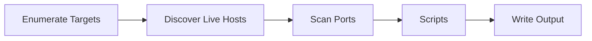

# Nmap Basics


**Nmap** (Network Mapper) is a **network discovery tool** used to discover devices and services on a computer network. It helps us answer 3 core questions: What hosts are up? *(Host Discovery)*, what ports are open? *(Port Scanning)*, what services run on these ports? *(Services & version detection)*. It's also an essential tool for **reconnaissance**.It uses multiple ways to specify its target:

- IP range using `-`: To scan IP addresses from 192.168.0.1 to 192.168.0.10; `192.168.0.1-10`
- IP subnet using `/`: If you want to scan a subnet 192.168.0.0-255; `192.168.0.1/24`
- Hostname: You can specify the target's hostname, eg. `wasssuppppp.com`

## Host Discovery

 A typical Nmap scan usually goes through the steps shown below,


Some steps have been excluded for the sake of brevity, they included **Version & OS detection** and **Traceroute**.

### Local Scan

A **local scan** scans the network that we are directly connected to. 

```python
nmap -sn 192.168.0.1/24
```

<center>

</center>

`-sn`(alias `-sP`) performs host discovery via **ping scan**/**no port scan** without scanning each of their ports, and attempts to resolve each of the MAC addresses to a vendor name. It also allows light reconnaissance of a target network without attracting much attention.

```bash
rabbitholex86@Arjit:~$ man nmap | grep -i "\-sn"
```
When we inspect the packets in Wireshark, we can see Nmap sending several ARP requests over the network:

<center>

</center>

### Remote scan

"Remote" means at least one router separates our system from the target network. Unlike local networks, we can’t send ARP requests directly — so Nmap uses ICMP packets to send **echo requests** and listen for **echo replies**.

```python
nmap -sn 192.168.11.1/24
```

<center>

</center>


## Sources

Network Chuck: [https://www.youtube.com/watch?v=4t4kBkMsDbQ&t=124s](https://www.youtube.com/watch?v=4t4kBkMsDbQ&t=124s)

TryHackMe:
- Nmap: The Basics: [https://tryhackme.com/room/nmap](https://tryhackme.com/room/nmap)
- Nmap Live Host Discovery: [https://tryhackme.com/room/nmap01](https://tryhackme.com/room/nmap01)
- Nmap Basic Port Scans: [https://tryhackme.com/room/nmap02](https://tryhackme.com/room/nmap02)
- Nmap Advanced Port Scans: [https://tryhackme.com/room/nmap03](https://tryhackme.com/room/nmap03)
- Nmap Post Port Scans: [https://tryhackme.com/room/nmap04](https://tryhackme.com/room/nmap04)

Getting your VM connected to your LAN: [https://www.youtube.com/watch?v=9hwr-bz85kk](https://www.youtube.com/watch?v=9hwr-bz85kk)