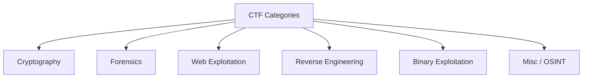

## What are CTFs?

CTFs (Capture The Flag) are cybersecurity competitions that involve challenges focused on information security. They provide a fun and practical way for both beginners and experts to develop, test, and prove their skills. There are several categories these challenges fall under, here are a few:

The purpose of this blog is to provide beginners with fundamental knowledge in CTFs and introduce them to the tools they can use to solve these challenges. 

A little side note, while **steganography** fallse under Forensics, we will have a separate section for it. You can find it on the [sidebar](/ctf-guide/Steganography/intro.md)! I will also link several external resources throughout the articles if you'd like to further study the concepts mentioned.

:::tip[info]

For information about ongoing CTFs, check out [CTFTime](https://ctftime.org/).

:::

Happy hacking ✨

<!--  -->

