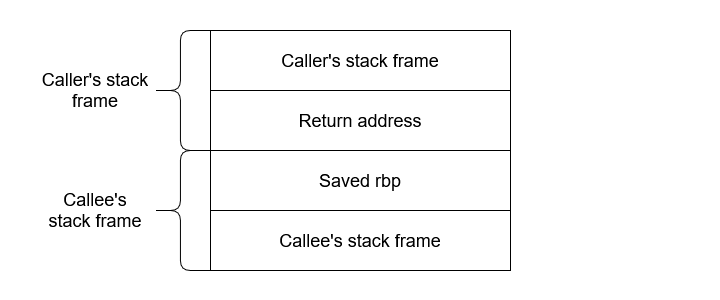
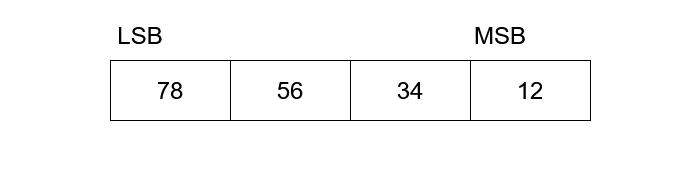
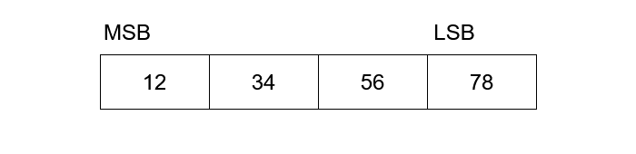
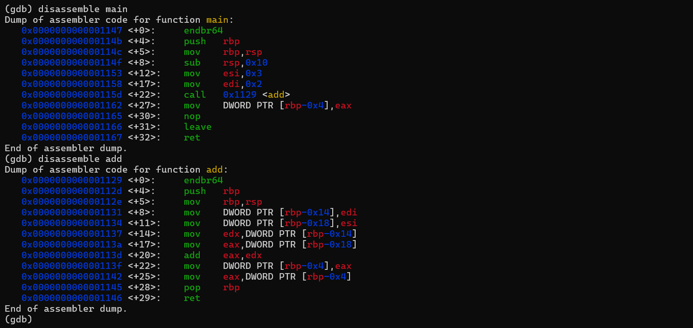

# What is the stack?

The **stack** is a special region of memory used to store local variables, function arguments, return addresses, and bookkeeping information during program execution. During a function call, a **stack frame** is created to accommodate the function’s arguments, local variables, and return address. Each function is allocated its own stack frame when it's called and deallocated when it has completed its execution.

Moreover, the stack grows downwards, from a higher to a lower memory address, in contrast to the **heap** which grows upwards from a lower to higher memory address.

> The heap is used for dynamic memory allocation and to store objects whose lifetime extends beyond a single function. *For the sake of brevity, we will not concern ourselves with the heap for now*.

# Stack operations

There are 2 main stack operations:

1.`push`: Appends to the stack and decrements the stack pointer (`rsp`).

2.`pop`: This reads a value and pops it off the stack. The value it reads is given by the stack pointer `rsp`

The amount by which the stack pointer is decremented depends on the machine architecture. In modern 64-bit, 1 unit of data is 8 bytes and in 32-bit machines it's 4 bytes. 

|Type|No. of bits|
|:---:|---|
|Bit|1 bit|
|Nibble|4 bits|
|Byte|8 bits|
|Word|16 bits (2 bytes)|
|DWORD|32 bits (4 bytes)|
|QWORD|64 bits (8 bytes)|

# Function Call, Stack Frame & registers

In a function call, there are 2 parties involved  

- The **caller** - the function that initiates the call.
- The **callee** - the function being called.

Before the callee’s stack frame can be set up, the CPU needs a way to return to the exact point in the caller where the call was made. This is accomplished using a **return address**.

In x86-64 assembly, a function call is performed using the `call` instruction:

```asm
call foo;
```

The `call` instruction pushes the return address onto the stack. This return address is not the address of the caller function itself, nor the address of the call instruction. Instead, it is the address of the **next instruction** immediately following the call, where execution should continue once the callee returns.

```psudocode
rsp = rsp - 8
[rsp] = return_address
rip = address_of(call foo)
```

> `rip` (Instruction Pointer register) is a register that *always* points to the next instruction to be executed. This means that prior to the function call, the rip holds the address of the (function) call instruction.

## Setting up the stack frame

```asm
push rbp
mov rbp, rsp
sub rsp, 0x20
```

When we set up a stack frame, we always start with these 3 lines of instruction. (`0x20` is a placeholder value for this example). How it works is fairly straightforward.

1. The old value of `rbp` is pushed onto the stack, saving the caller's base pointer. `[rsp]` (at the top of the stack) now holds the previous `rbp` value.

```pseudocode
rsp = rsp - 8
[rsp] = old_rbp
```

2. `mov rbp, rsp` creates a new base pointer for the callee function by moving the address stored in `rsp` to `rbp`. The new `rbp` now marks the start of the function's stack frame.

```pseudocode
rbp = rsp
```

3. We finally allocate memory for the callee function’s local variables using the `sub` instruction. In the example above, we have reserved 32 bytes (0x20 in hexadecimal) of stack space.

```psudocode
rsp = rsp - 0x20
```
This is what our stack would look like by now:

<center>



</center>

> The return value is stored in the `rax` register, before the `ret` instruction is called, which collapses the callee function's stack frame and returns execution to the caller function.

## Deallocating the stack frame

Once the function is finished executing, it will call the return instruction `retq`. This instruction will pop the value of the return address off the stack, deallocate the stack frame for the add function, change the instruction pointer to the value of the return address, change the stack pointer `rsp` to the top of the stack and change the base pointer (sometimes called the *frame* pointer) `rbp` to the caller's stack frame.

# Endianness

Endianness is the order in which bytes are stored in the memory. Let's take, for example, the hexadecimal value `0x12345678` (we’re using hexadecimal because bytes aren’t human-readable).

Given our hexadecimal value `0x12345678`, we can tell that the right most hex value `78` is the least significant value, whereas the hex value `12` is the most significant value.

**Little Endian** is where bytes are arranged from the least significant byte to the most significant byte.

<center>



</center>

**Big Endian** is where bytes are arranged from most significant byte to least significant byte.

<center>



</center>

Here, each “value” requires at least a byte to represent, as part of a multi-byte object.

Knowing how the stack works is important to understand how to perform **buffer overflows**, a type of binary exploitation technique. To learn more about this, feel free to read it here: [https://ctf101.org/binary-exploitation/buffer-overflow/](https://ctf101.org/binary-exploitation/buffer-overflow/)

---

# Example

Let’s tie all these concepts together by looking at how a simple C function is compiled and executed on the stack. Here we've been given a C program. Take a minute to analyse it. If you don't know C, I recommend checking out [https://www.learn-c.org/](https://www.learn-c.org/)

```c
int add(int a, int b){
    int c = a + b;
    return c;
}

void main(){
    int res = add(2, 3);
}
```

Disassembling the program with `gdb` yields the following output:



We see that the assembly program starts by setting up the stack frame for the `main()` function.

```asm
push rbp
mov rbp, rsp
sub rsp, 0x10
```

Here, we have allocated 16 bytes of memory for local variables. `0x10 = (1*[16^1]) + (0*[16^0]) = 16`. The next 3 lines of assembly store values 3 and 2 into registers `edi` and `esi`, and call the function `add()`. 

> `edi` and `esi` are the lower 32 bits of our 64-bit **callee-owned registers** `rdi` and `rsi`. They are used to store callee arguments. Read more about them [here](https://web.stanford.edu/class/archive/cs/cs107/cs107.1202/guide/x86-64.html)

```asm
mov esi, 0x3
mov edi, 0x2
call 0x1129 <add>
```

Notice the `0x1129`? This is the entry point of our `add` function. When this instruction is executed, the CPU jumps to that address. We then again set up a stack frame, but this time for the callee function `add`. 

```asm
push rbp
mov rbp, rsp
```
The next 5 lines after that, shows us moving the values from registers `edi` and `esi` to `edx` and `eax` and performing the `add` instruction. 

> `eax` is simply the lower 32 bits of our 64-bit `rax` register, which we use to store the return value. 

```asm
mov DWORD PTR [rbp-0x14], edi
mov DWORD PTR [rbp-0x18], esi
mov edx, DWORD PTR [rbp-0x14]
mov eax, DWORD PTR [rbp-0x18]
add eax, edx
```

:::note[Why do we move values from registers instead of adding them as they are in `edi` and `esi`?]

In short, for the compiler to perform addition and return the result, it needs to somehow move this result to the register `eax`. To do this, it first moves these values into local variable `[rbp-0x14]` and `[rbp-0x18]`, then into `edx` and `eax`, where it then performs the `add` instruction. The move to local variables is done only because of debugging/safety or compiler settings, not because it has to.

:::

After computing the result and moving it to `eax` the value of `rbp` is popped and `ret` is called, where `add`'s stack frame is collapsed and execution is returned to `main()`.

```asm
mov DWORD PTR [rbp-0x4], eax
```

The return value is then stored in main's local variable, and the program ends by finally calling  `ret` once again, but this time to deallocate main's stack frame.

---

By now you should be familiar with:

1. What stack memory is
2. How stack operations (`push`/`pop`) work
3. How stack frames are allocated and deallocated
4. Basic execution flow during function calls
5. Key registers (`rbp`, `rsp`, `rip`, `rax`/`eax`, `rdi`/`edi`, `rsi`/`esi`)


